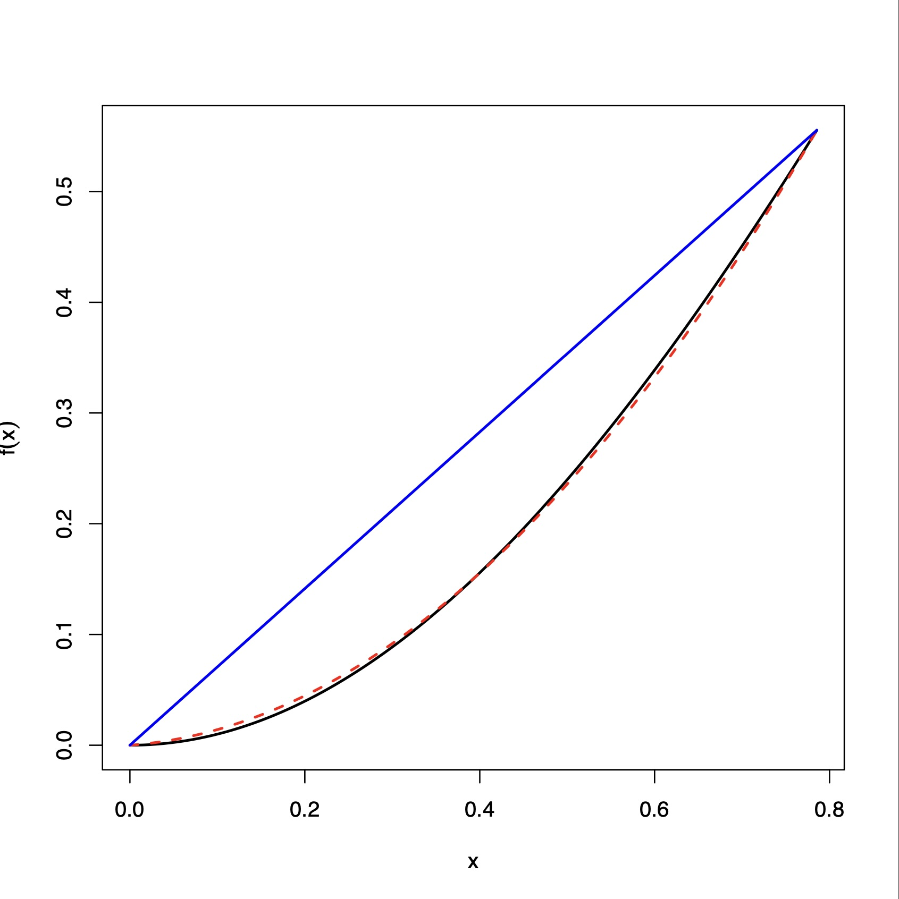
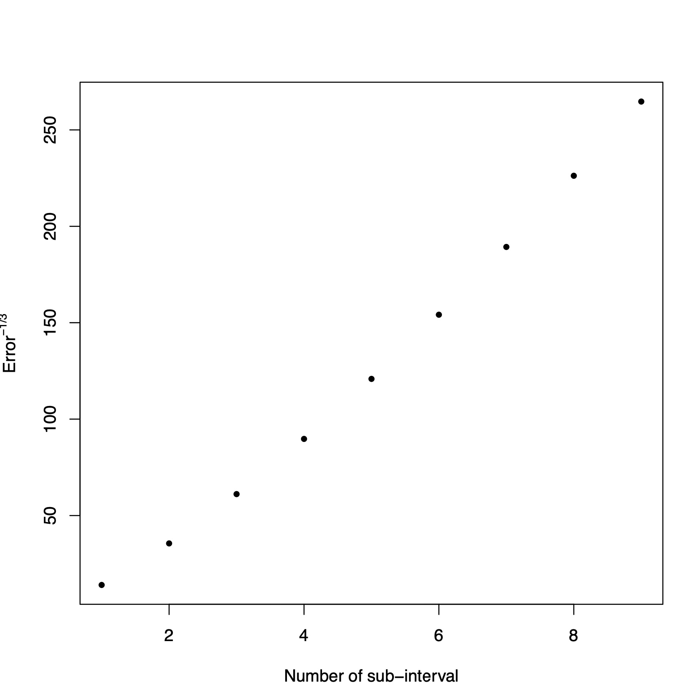

# Chapter 4: Numerical Integration

### Example 4.2.1

```{R}
# install.packages("PolynomF")
library("PolynomF")
f = function(x) {
  return(x * sin(x))
}
f1 = poly_calc(c(0,pi/4), c(0,f(pi/4)))
f2 = poly_calc(c(0, pi/8, pi/4), c(0, f(pi/8), f(pi/4)))
plot(f,xlim=c(0,pi/4),ylab=expression(f(x))
     ,lwd=2,col='black')
curve(f2,add=TRUE,col="red",lwd=2,lty=2)
curve(f1,add=TRUE,col="blue",lwd=2)
```
<p align = "center">

</p>

### Example 4.2.2

```{R}
f = function(x) {
  return(x * sin(x))
}
simpsons.rule = function(f, a, b) {
  h = (b - a) / 2
  x0 = a
  x1 = a + h
  x2 = b
  s = (h / 3) * (f(x0) + 4 * f(x1) + f(x2))
  return(s)
}
simpsons.rule(f, 0, pi/4)

## [1] 0.1513826
```

```{R}
library(latex2exp)
composite.simpson = function(f, a, b, m) {
  h = (b - a) / {2*m}
  xj = seq.int(a, b, length.out = 2*m + 1)
  xj = xj[-1]
  xj = xj[-length(xj)]
  n = length(xj)
  approx = (h / 3) * (f(a) 
                      + 2 * sum(f(xj[seq.int(2, n, 2)]))
                      + 4 * sum(f(xj[seq.int(1, n, 2)])) 
                      + f(b)
                      )
  return(approx)
}
g = rep(0,times=9)
g[1] = simpsons.rule(f, 0, pi/4)
for(i in 2:9){g[i] = composite.simpson(f, 0, pi/4,i)}
x = pi/4
u = -x*cos(x)+sin(x)
plot(1/(u-g)^(1/3), xlab="Number of sub-intervals"
     , ylab=TeX("$Error^{-1/3}$")
     , pch=20)
```
<p align = "center">

</p>


```{R}
x = pi/4
u = sin(x)-x*cos(x)
#install.packages("gaussquad")
library("gaussquad")
g<-rep(0,5)
for(i in 1:5){
  rules = legendre.quadrature.rules( i+1 )
  order.np1.rule = rules[[i+1]]
  g[i] = legendre.quadrature(f, order.np1.rule
                             , lower=0,upper=pi/4)
}
abs(u-g)

## [1] 2.429760e-04 4.900268e-07 4.608492e-10 2.506051e-
13 1.110223e-16
```

### Example 4.3.1

```{r}
hermite.he.quadrature(u(1+exp(sigma*x+mu),rule)/sqrt(2*pi)
```

### Example 4.3.2 (Total Profit of Monopolist)

```{r}
f = function(t){exp(-0.05*t)*(2-exp(-5*t))^(1-1.25)}
for(i in 1:5){
  rules = laguerre.quadrature.rules( i+1 )
  order.np1.rule = rules[[i+1]]
  g[i]=laguerre.quadrature(f, order.np1.rule)
}
et = 1.25
et*(1-1/et)^(et-1)*g[5]

## [1] 0.6841649
```
