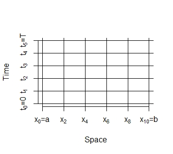

# Chapter 6: Numerical Methods for PDE

<p align = "center">

</p>

```{r}
r = 0.01
s = 0.3
s0 = 50
T = 1
f = function(z) max(z,0)
a = -8
b = 8
N = 1000
M = 1000
x = seq(a,b,(b-a)/N)
al = (r -s^2/2)/s^2
be = (r - s^2/2)^2/(2*s^2) + r
la = (s^2/2)*(1/M)/((b-a)/N)^2
price = K =rep(0,8)
pp = price
for(l in 1:8){
  K[l] = 30+5*l
  w = matrix(0,M,N)
  for(j in 1:N){w[j,1] = exp(al*x[j])*f(exp(x[j])-K[l])}
  for(i in 2:M){
    w[1,i] = 0
    w[N,i] = exp(8)
    for (j1 in 2:(N-1)){
      w[j1,i] = la*w[j1-1,i-1]+(1-2*la)*w[j1,i-1]+la*w[j1+1,i-1]
    }
    jj = ceiling((log(s0)-a)/((b-a)/N))
    price[l] = w[jj,M]*exp(-al*x[jj]-be*T)
    pp[l] = blackscholes(s0,K[l],r,T,s,0)  
  }
}

plot(NULL,ylim=c(0.94,1.02),xlim=c(K[1],K[8])
     ,ylab='pp/price',xlab='K')
grid(col='cadetblue4',lty=3,lwd=2)
points(K,pp/price,pch=20,col='purple3',type='b')
```
