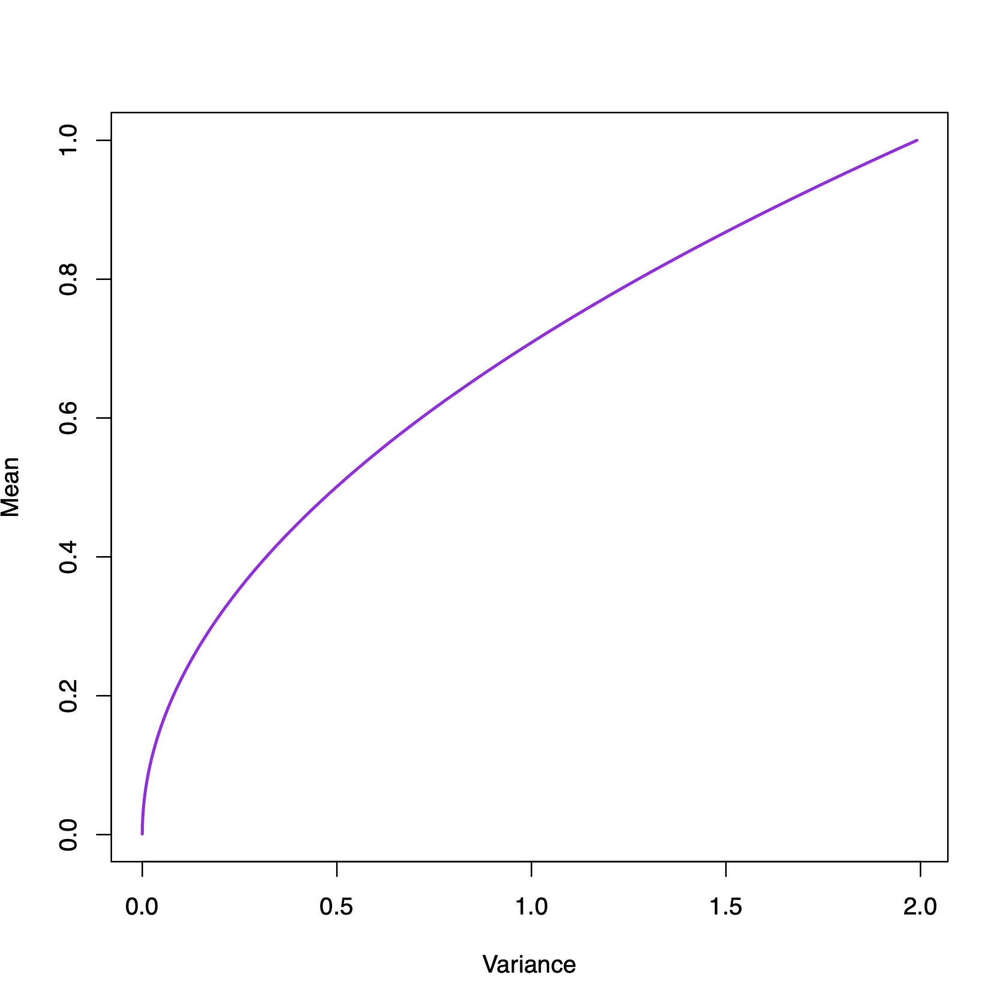

# Chapter 7: Optimization

### Example 7.1.3

```{r}
library(lpSolveAPI)
# Construct the optimization problem
lprec <- make.lp(2, 5)
set.column(lprec, 1, c(1,5))
set.column(lprec, 2, c(1,4))
set.column(lprec, 3, c(1,3))
set.column(lprec, 4, c(1,2))
set.column(lprec, 5, c(1,1))
## Setup the objective function
set.objfn(lprec, c(6,5,4,5,6))
set.constr.type(lprec, c(">=", ">="))
set.rhs(lprec, c(3,14))
# Reun the optimization

solve(lprec)  
## [1] 0

get.objective(lprec)  
## [1] 17
```

### Example 7.2.1

```{r}
library(PortfolioAnalytics)
library(quadprog)
data(edhec)
#head(edhec)
dim(edhec)
x = rep(0,1000)
y = x
A = apply(edhec,2,mean)
n = length(A)
Amat1 = matrix(A,n,1)
Amat = cbind(Amat1, diag(rep(1,times=n),n))
Dmat = 2*var(edhec)
dvec = matrix(0,n,1)
for(i in 1:1000){
  y[i] = i*0.001
  bvec = matrix(c(y[i],rep(0,times=n)),n+1,1)
  S = solve.QP(Dmat,dvec,Amat,bvec)
  x[i] = S$value
}
plot(x,y,type="l", xlab="Variance", ylab="Mean"
     ,lwd=2,col='purple')
round(S$solution,2)
# 0.00  5.43  0.00  0.00 69.61  0.00  7.61  0.00  0.00 96.95 27.85 15.61  0.00
```


<p align = "center">

</p>
