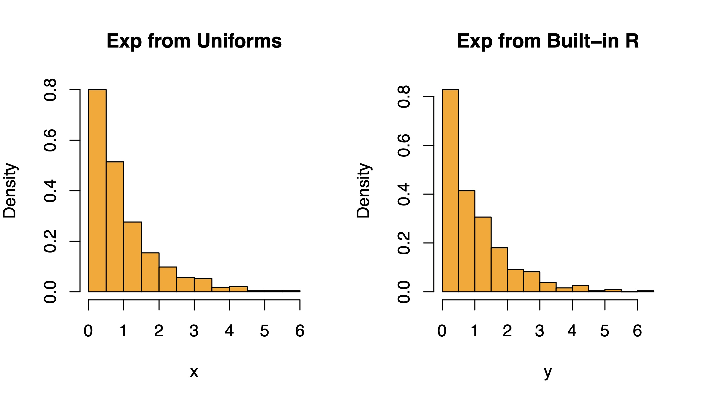
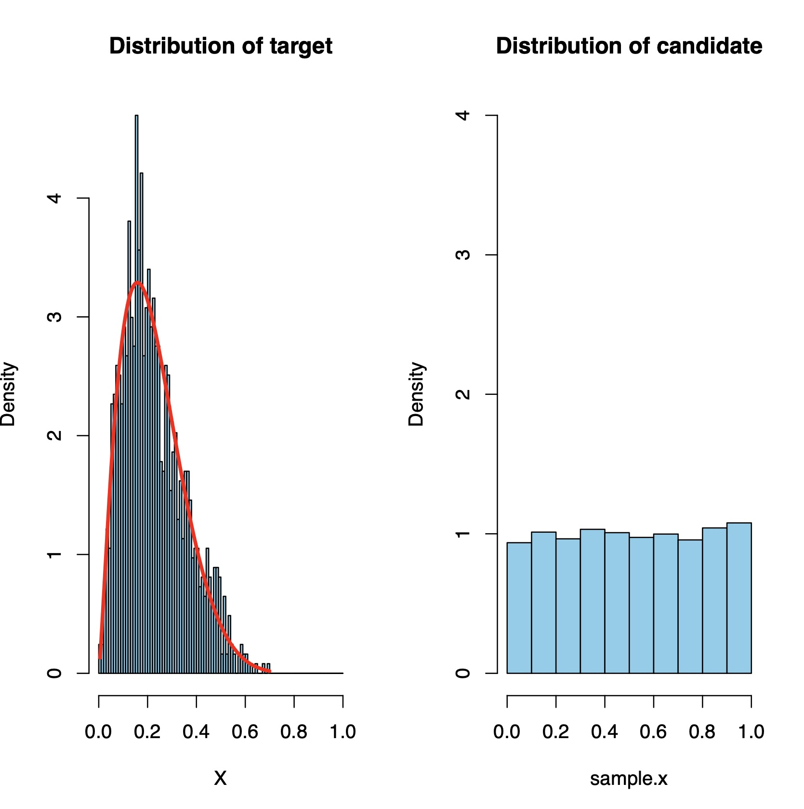

# Chapter 8: Monte Carlo Methods

### Linear Congruential Generator

```{r}
m = 17
a = 6
x = 7
u = rep(0,20)
for (i in 1:20){
  x=(a*x)%%m
  u[i]=x/m
}
```
### Example 8.2.1

```{r}
# Number of random samples
N=1000
# Simulate from uniforms
u=runif(N)
# transforms of uniforms
x= -log(1-u)
# exponential in R
y=rexp(N)
par(mfrow=c(1,2)) # plot parameters 
hist(x,freq=F,main="Exp from Uniforms",col="orange") 
hist(y,freq=F,main="Exp from Built-in R",col="orange")
```


<p align = "center">

</p>

```{r}
inv.transform <- function( p ) {
  U = runif(1)
  s = 0
  i = 0
  while(s < U ) {
    i = i+1
    s = s+p[i]
  }
  return(i)
}
n = 1000
p = c(0.2, 0.4, 0.3, 0.1)
names(p) = 1:4
samples = rep(0,n)
for(i in 1:n) {
  samples[i] = inv.transform(p)
}
pp = table(samples)/n
barplot(rbind(p,pp), beside=T,
        angle=c(0,0), density=c(10,0),
        ylab="Probability",xlab="Value")
legend("topright", c("true","observed"),
angle=c(0,0), density=c(10,0),
       bty="n", cex=0.75)
```


```{r}
set.seed(1010)
N=5000
sample.x = runif(N,0,1)
accept = c()
for(i in 1:length(sample.x)){
 U = runif(1, 0, 1) 
 if(dunif(sample.x[i], 0, 1)*4*U<= dbeta(sample.x[i], 2.3, 7.9)){ 
   accept[i] = 'Yes'
 }else if(dunif(sample.x[i],0,1)*4*U > dbeta(sample.x[i], 2.3, 7.9)){
  accept[i] = 'No' 
 }
 }
T = data.frame(sample.x
               , accept = factor(accept
                     , levels= c('Yes','No')))
x = sort(T[,1][T$accept=='Yes'])
par(mfrow=c(1,2))
hist(x, breaks = seq(0,1,0.01), freq = FALSE
     , main = 'Distribution of target'
     , xlab = 'X',col='skyblue')
lines(x, dbeta(x,2.3,7.9),col="red",lwd=3)
hist(sample.x
     ,main= 'Distribution of candidate'
     ,freq=FALSE,col='skyblue'
     ,ylim=c(0,4))
cat("Acceptance Rate :","\n")
## Acceptance Rate :
(length(x)/length(sample.x))*100

## [1] 26.18
```


<p align = "center">

</p>
