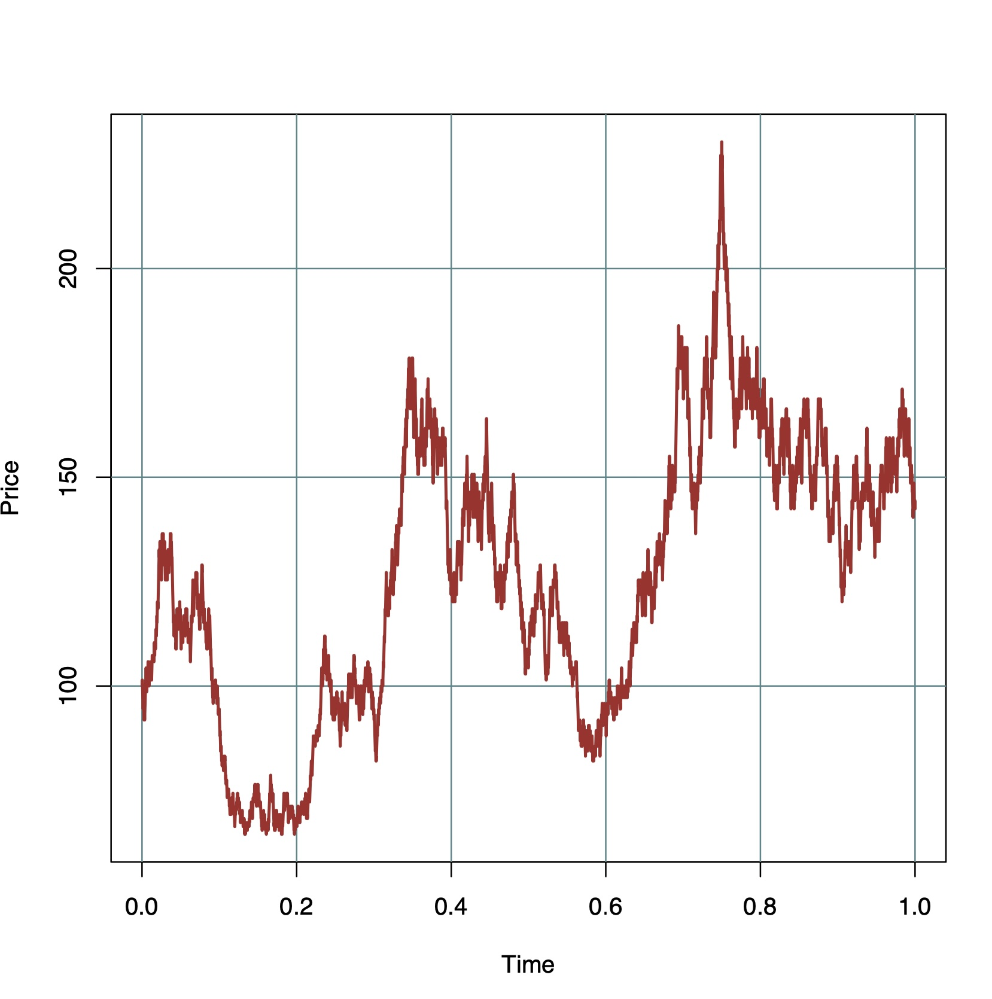

# Chapter 9: Lattice Models

```{r}
## simulate from Binomial Asset Pricing Model
sim.BAPM = function(P0,n,r,sigma){
  # n is the number of periods of the chain.
  # P0 is the value of the asset at the initial time.
  # r is the risk free rate.
  # sigma is the volatility.
  P = rep(NA,n) # Define a vector for price path
  P[1] = P0 # Initial price
  u = exp(sigma/sqrt(n)) # Up-factor
  d = 1/u # Down-factor
  p = (1+(r/n)-d)/(u-d) # Risk-neutral probability
  q = 1-p
  for(i in 2:n){
      # Drawing random toss from an unbiased coin
      toss<-sample(c("Head","Tail"),1,replace = TRUE
      ,prob = c(p,q))
      # If head - price goes up by factor u
      if(toss=="Head")P[i]<-P[i-1]*u
      # If tail - price goes down by factor d
      if(toss=="Tail")P[i]<-P[i-1]*d
  }
  return(P)
}
set.seed(1234)
P = sim.BAPM(P0=100,n=5000,r=1,sigma=1)
plot(NULL,xlim=c(0,1),ylim=c(min(P),max(P))
     ,xlab="Time"
     ,ylab="Price")
grid(col='cadetblue4',lty=1)
points(seq(1:5000)/5000, P, type="l"
       ,lwd=2,col='brown',lty=1)

```


<p align = "center">

</p>