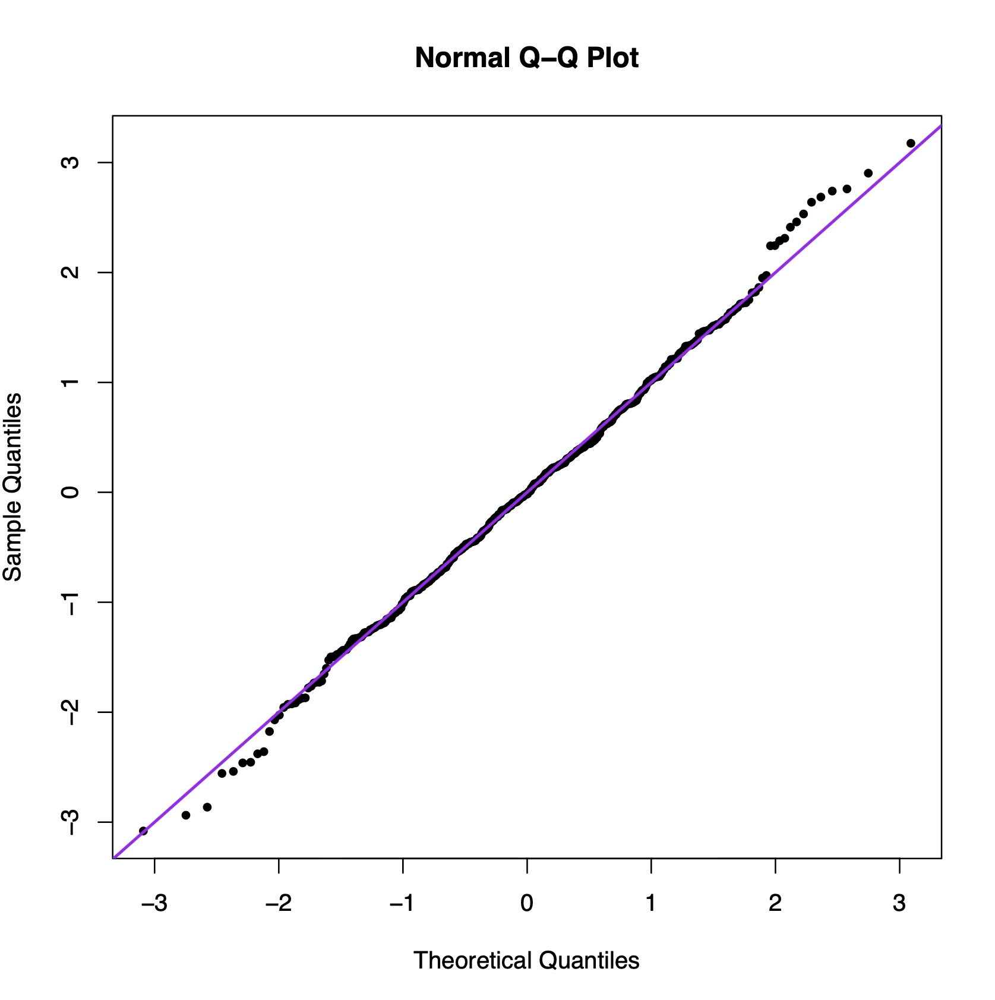
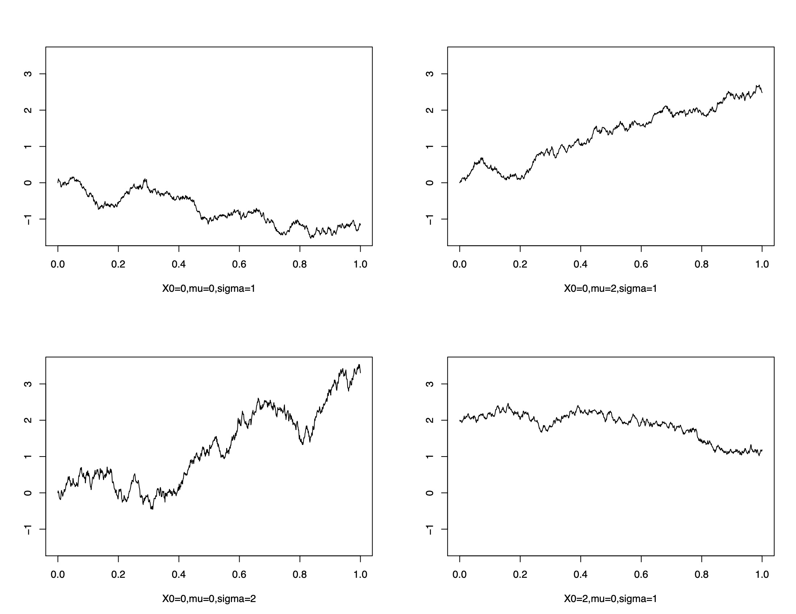
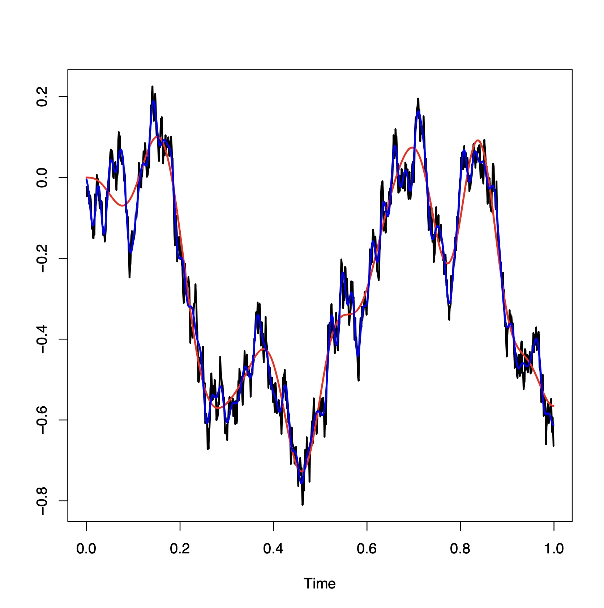
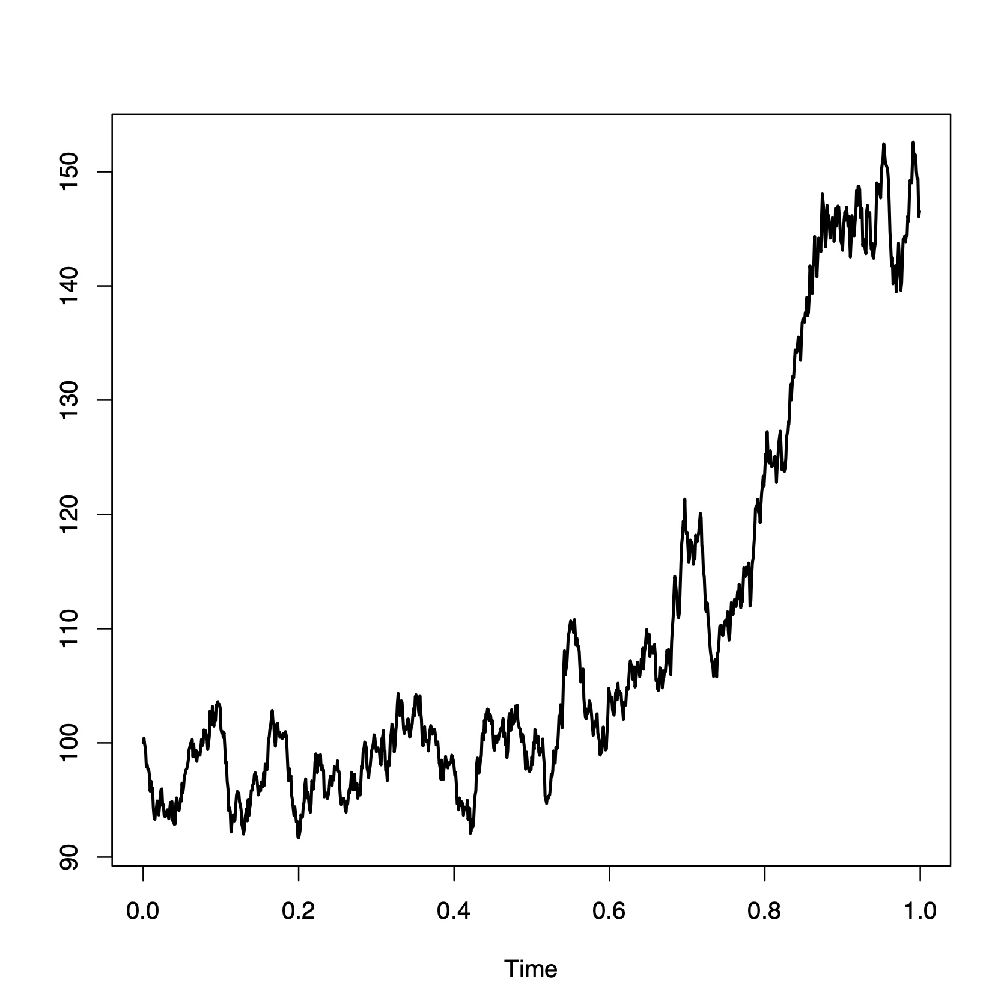

# Chapter 10: Simulating Brownian Motion


```{r}
t<-rep(0,1000)
for(i in 1:1000){
    x=rnorm(500,0,1)
    t[i]=shapiro.test(x)$p.value
  }
length(which(t<.05))/1000
RNGkind(normal.kind = "Box-Muller")
for(i in 1:1000){
    x<-rnorm(500,0,1)
    t[i]<-shapiro.test(x)$p.value
  }
length(which(t<.05))/1000
qqnorm(x,pch=20)
## [1] 0.049

abline(0,1,lwd=2,col='purple')
```


<p align = "center">

</p>

```{r}
N = 100
mu = c(1,2)
sigma = matrix(c(1,.5,.5,.3),2,2)
M = t(chol(sigma))
Z = matrix(rnorm(2*N),2,N)
bvn = t(M %*% Z) + matrix(rep(mu,N), byrow=TRUE,ncol=2)
```

```{r}
sim.Brownian.motion = function(X0,t,mu,sigma){
   n = length(t)
   X = rep(NA,n)
   Z = rnorm(n,mean=0,sd=1)
   X[1] = X0+sigma*sqrt(t[1])*Z[1]+mu*t[1]
   for(i in 2:n){
     X[i] = X[i-1]+sigma*sqrt(t[i]-t[i-1])*Z[i]+mu*(t[i]-t[i-1])
   }
   return(X)
 }
t = seq(0,1,0.001)
X = sim.Brownian.motion(X0=0,t=t,mu=0,sigma=1)
plot(ts(P,start=0,frequency = 1000),ylab="")
```


<p align = "center">

</p>


```{r}
set.seed(896)
sig = matrix(0,1000,1000)
for(i in 1:1000){
  for(j in 1:1000){
    sig[i,j]=min(i,j)/1000
  }
}
u = eigen(sig)
v = cumsum(u$values)
v = v/v[1000]
z = rnorm(1000,0,1)
zz = z*sqrt(u$values)
ful = u$vectors%*%zz
app = u$vectors[,1:100]%*%zz[1:100]
app1 = u$vectors[,1:20]%*%zz[1:20]
plot(ts(ful,start=0,frequency = 1000),ylab="",lwd=2)
lines(ts(app1,start=0,frequency = 1000),col='red',lwd=2)
lines(ts(app,start=0,frequency = 1000),col='blue',lwd=2)
```


<p align = "center">

</p>

```{r}
set.seed(896)
mu = 5
sig = 3
step = 1/1000
length = 1
s0 = 100
N = length/step
m = (mu-sig^2/2)*step
s = sig^2*step
R = rnorm(N-1,m,s)
X = rep(0,N)
X[1] = log(s0)
for(i in 2:N){
  X[i] = X[i-1]+R[i-1]
}
GBM<-exp(X)
plot(ts(GBM,start=0,frequency=1/step),ylab="",lwd=2)
```
<p align = "center">

</p>

```{r}
ff = function(x){max(x,0)}
down = which(mingbm>90)
mean(sapply(lgbm[down]-150,ff))
```
