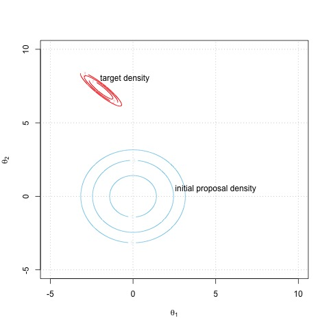
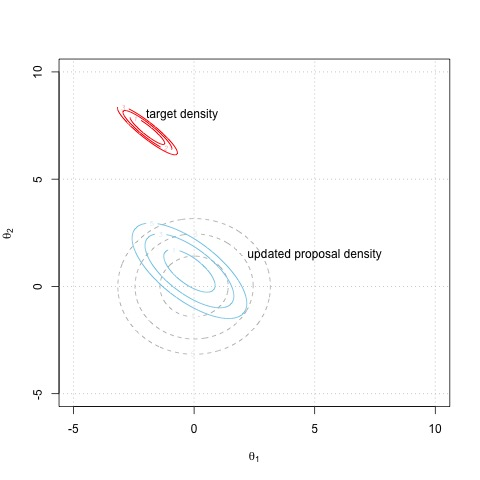
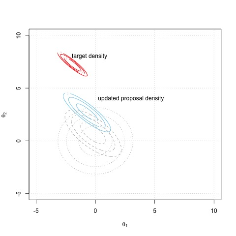
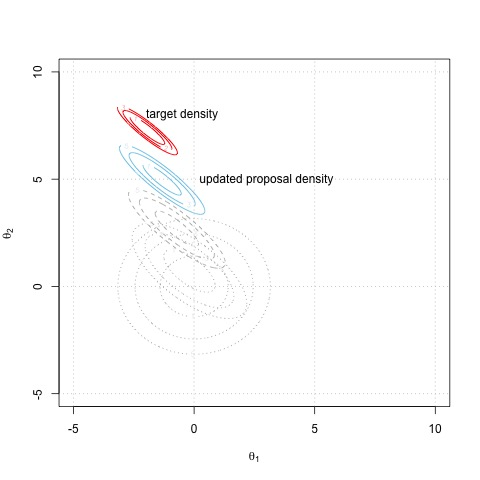

# Chapter 14: Bayesian Computation

```{r}
library(insuranceData)
data(dataCar)
tbl = table(num_of_claims = dataCar$numclaims)
barplot(tbl,ylab = 'Frequency'
        ,xlab='Number of Claims'
        ,col='orange')

```

```{r}
## Frequency Table of Number of Claims
tbl

## num_of_claims     0     1     2     3     4
## Frequency     63232  4333   271    18     2

c(mean = round(mean(dataCar$numclaims),3)
  ,var = round(var(dataCar$numclaims),3))
  
##  mean   var
## 0.073 0.077
```

```{r}
t = sum(dataCar$numclaims)
t
n = nrow(dataCar)
n
### MLE of lambda
lambda_hat = t/n
lambda_hat

## prior lambda ~ Gamma(a=1,b=1)
a=b=1

## Prior mean of lambda
cat('Prior mean of lambda = ',a/b,'\n')

## Prior mean of lambda =  1

## Posterior mean
cat('Posterior mean of lambda = ' ,(t+a)/(n+b),'\n')

## Posterior mean of lambda = 0.07277068

## 95% Frequentist Interval
se_mle = sqrt(lambda_hat/n)
Frequentist_CI = round(c(lambda_hat-1.96*se_mle,
                   lambda_hat+1.96*se_mle),3)
cat('Frequentist 95% CI = ', Frequentist_CI,'\n')

## Frequentist 95% CI =  0.071 0.075

## 95% prior Bayesian confidence interval
prior_CI = round(qgamma(c(0.025,0.975)
                  ,shape = a,rate=b),3)
cat('Prior 95% CI = ', prior_CI,'\n')

## Prior 95% CI =  0.025 3.689

## 95% Bayesian credible interval
posterior_CI = round(qgamma(c(0.025,0.975)
                      ,shape = t+a,rate=n+b),3)
cat('Posterior 95% CI = ', posterior_CI,'\n')

## Posterior 95% CI = 0.071 0.075
```


```{r}
### NIF prior
a=1; b=0
## Posterior mean under NIF prior 
cat('posterior mean = ',(a+t)/(b+n),'\n')

## posterior mean =  0.07277175

## 95% Bayesian credible interval 
## under NIF prior
Bayesian_CI = qgamma(c(0.025,0.975)
                     ,shape = t+a,rate=n+b)
Bayesian_CI = round(Bayesian_CI,3)
cat('Bayesian 95% CI = ', Bayesian_CI,'\n')

## Bayesian 95% CI =  0.071 0.075

### Jeffrey’s prior
a=0.5; b=0
## Posterior mean under Jeffrey’s prior 
cat('posterior mean = ',(a+t)/(b+n),'\n')

## posterior mean =  0.07276438

## 95% Bayesian credible interval 
## under Jeffrey’s prior 
Bayesian_CI = qgamma(c(0.025,0.975)
                     ,shape = t+a,rate=n+b)
Bayesian_CI = round(Bayesian_CI,3)
cat('Bayesian 95% CI = ', Bayesian_CI,'\n') 

## Bayesian 95% CI = 0.071 0.075
```


```{r}
dHalfCauchy=function(theta,log=FALSE){
  if(log==FALSE){
    return(2/(pi*(1+theta^2)))
  }else{
    return(log(2)-log(pi)-log(1+theta^2))
  }
}
```

```{r}
logLike = function(lambda,t,n){
  l = dpois(t,lambda = n*lambda,log=TRUE) 
  return(l)
}
logPosterior = function(lambda,t,n){ 
  lpost = logLike(lambda=lambda,t=t,n=n)
          +dHalfCauchy(theta=lambda,log=TRUE)
  return(lpost)
}
## Check log-posterior at an initial value
lambda.init = 1
logPosterior(lambda=lambda.init,t=t,n=n)
```

```{r}
optimize(f=logPosterior,lower = 0,upper=10
         ,t=t,n=n,maximum=TRUE)

## $maximum
## [1] 0.07276539
##
## $objective
## [1] -5.171245

```
### Bayesian Inference with Monte Carlo for Any Model


```{r}
y = c(6, 2, 2, 1, 2, 1, 1, 2, 3, 5, 2,1)
IS=function(y,C,N){
    ## y : data
    ## C : C is the tuning parameter for
    ## the g distribution
    ## N : the number of monte carlo samples
    # sample size
    n = length(y)
    # log-post
    log.posterior = function(t){
    lp = sum(dpois(y,t,log=TRUE))
                 +dlnorm(t,2,1,log=TRUE)
        return(lp)
    }
    
    # parameters for the trial distribution
    a = C*mean(y); b = C;
    # log trial density, g
    log.g = function(t){ 
      dgamma(t,a,b,log=TRUE)
    }
    
    
    # log importance function
    log.w = function(t){ 
      log.posterior(t) - log.g(t)
    }
    
    
    # generate from the trial distribution
    U = rgamma(N, a, b)
    
    # calculate the list of log.w values
    LP = log.w(U)
    
    # factor out the largest value to prevent 
    # numerical underflow
    w = max(LP)
    LP = LP - w
    
    # importance sampling estimate
    I = mean( exp(LP)*U )/mean(exp(LP))
    
    # calculate V
      V = mean(((exp(LP)/mean(exp(LP))) - 1)^2 )
      # calculate s.e. of the IS estimate
    Z = exp(LP)/mean(exp(LP))
    sig.sq = (1/N)*sum( (Z-I)^2 )
    se = sqrt( sig.sq/N )
    # return the 95 percent confidence interval 
    # for the estimate
    return(c(I - 1.96*se, I + 1.96*se, V, I))
}
set.seed(5818)

## calculate V, E(theta|X), and var(E(theta|X)) 
## for a grid of values for c
const = seq(.05, 20, length=500)
A = matrix(0, 500, 2)
for(j in 1:500){
  OUT = IS(y, const[j], 1000) 
  V = OUT[3]
  Var = (OUT[2]-OUT[1])/3.92 
  A[j,] = c(V, Var)
}
# final Estimate
IS(y, const[which.min(A[,2])], 1000)[4]

## [1] 2.424335
```

### Markov Chain Monte Carlo

<p align = "center">


        



</p>

```{r}
library('mvtnorm')

data = read.csv(file='stock_treasury.csv')
n = nrow(data)
cat('Sample size = ',n,'\n')

# Risk Free Rate is in percentage and annualised. 
# So the following conversion is required.
Rf = data$UST_Yr_1/(250)

## Compute log-return in percentage
ln_rt_snp500 = diff(log(data$SnP500))*100
ln_rt_snp500 = ln_rt_snp500-Rf[2:n]
ln_rt_ibm = diff(log(data$IBM_AdjClose))*100
ln_rt_ibm = ln_rt_ibm-Rf[2:n]
ln_rt_apple = diff(log(data$Apple_AdjClose))*100
ln_rt_apple = ln_rt_apple - Rf[2:n]
ln_rt_msft = diff(log(data$MSFT_AdjClose))*100
ln_rt_msft = ln_rt_msft-Rf[2:n]
ln_rt_intel = diff(log(data$Intel_AdjClose))*100
ln_rt_intel = ln_rt_intel-Rf[2:n]

## log-return of the portfolio
ln_r = cbind(ln_rt_ibm,ln_rt_apple,ln_rt_msft,ln_rt_intel)
```

```{r}
### Portfolio return
w = c(0.2,0.3,0.25,0.25)
ln_rt_portf = ln_r%*%w
```

```{r}
log_likelihood = function(param,y,x){ 
  a = param[1]
  b = param[2]
  lambda = param[3]
  pred = a + b*x
  likelihoods = -log(2*lambda)-abs(y-pred)/lambda
  sumll = sum(likelihoods)
  return(sumll)
}
```

```{r}
dHalfCauchy = function(theta,log=FALSE){ 
  if(log==FALSE){
    return(2/(pi*(1+theta^2))) 
  }else{
    return(log(2)-log(pi)-log(1+theta^2)) 
  }
}
```

```{r}
log_prior = function(param,x){ 
  a = param[1]
  b = param[2]
  lambda = param[3]
  a_prior = dcauchy(a,0,1,log = T)
  b_prior = dcauchy(b,0,1,log = T)
  scale_prior = dHalfCauchy(theta=lambda,log = T)
  return(a_prior+b_prior+scale_prior) 
}
```

```{r}
log_posterior = function(param,y,x){
  like = log_likelihood(param=param,y=y,x=x) 
  prior = log_prior(param=param,x=x)
  post = like + prior
  return ( post )
}
```

```{r}
proposalfunction = function(param,x){ 
  X=cbind(rep(1,length(x)),x) 
  S=param[3]*solve(t(X)%*%X)
  prop = c(rmvnorm(1
                  ,mean = param[1:2]
                  ,sigma = S)
          ,rgamma(1,param[3]*5,5))
  return(prop) 
}
```

```{r}
run_metropolis = function(startvalue, N.sim, burnin){ 
  iterations = N.sim + burnin
  chain = array(dim = c(iterations+1,3))
  chain[1,] = startvalue
  for (i in 1:iterations){
    proposal = proposalfunction(chain[i,],x=x)
        probab = exp(log_posterior(param=proposal
                                   ,y=y,x=x)
                     - log_posterior(param=chain[i,]
                                     ,y=y,x=x))
        if (runif(1) < probab){ chain[i+1,] = proposal
        }else{
        chain[i+1,] = chain[i,]
        }
  }
  return(chain) 
}
```

```{r}
options(warn=-1)
y=ln_rt_portf
x=ln_rt_snp500
startvalue = c(1,0,1)
N.sim=1000
burnin=0
set.seed(1)
chain = run_metropolis(startvalue=startvalue
                       ,N.sim=N.sim
                       ,burnin=burnin)
colnames(chain)=c("alpha","beta","lambda")
chain=chain[(burnin+1):nrow(chain),]
options(warn=0)
```

```{r}
par(mfrow=c(3,2))
plot(ts(chain[,"alpha"]),lwd=2
     ,ylab = "alpha")
plot(density(chain[,"alpha"]),lwd=2
     ,main = "",col='red'
     ,xlab = "alpha")
plot(ts(chain[,"beta"]),lwd=2
     ,ylab = "beta")
plot(density(chain[,"beta"]),lwd=2
     ,main = "",col='red'
     ,xlab = "beta")
plot(ts(chain[,"lambda"]),lwd=2
     ,ylab = "lambda")
plot(density(chain[,"lambda"]),lwd=2
     ,main = "",col='red'
     ,xlab = "lambda")
```

```{r}
alpha_star = chain[,'alpha']
no.of.alpha.gt.zero = length(alpha_star[alpha_star>0])
total.no.of.alpha = length(alpha_star)
prob_a_gt_zero = (no.of.alpha.gt.zero/total.no.of.alpha)
round(prob_a_gt_zero,4)
```
