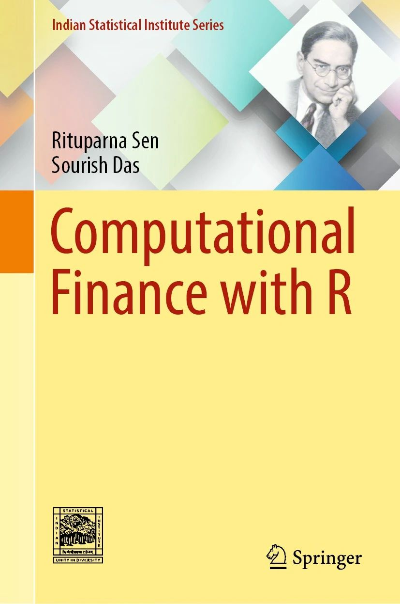

# Computational Finance with `R`
All codes of the book titled "Computational Finance with R"

Discusses all aspects of computation, namely numerical, simulation, and statistical, in a single book
Explains every procedure with R code and is illustrated with tables and figures
Includes two chapters on machine learning in finance based on cutting-edge research topics

+ Available at [Springer](https://link.springer.com/book/10.1007/978-981-19-2008-0)

+ Available at [Amazon](https://www.amazon.in/Computational-Finance-Indian-Statistical-Institute/dp/9811920079/ref=sr_1_1?crid=XB6CS1Y1KZSN&dib=eyJ2IjoiMSJ9.7Yk_gU1_xW0jHnqTvFO1s9NlBiEzJh9rcZTNMBrBqYrHjxqfWPWf1R4tKm0f-hKBHWebIrq3nouN52ey-dbg4o9hZHkToRFws9VrnrizzVefkNZtiOd4klyLuiMthkk-2Wp7sBLEMhLgelo7nKl9w09LZ6ZjzvKnZbwdT8gf2xYHFOor7ibFaD68EHGuOs13pI-p0_3hlqYDjJI8kSYwBvrgNLIJWj2jM52yaNHEA_Q.MTGH5M1y2MSsYN45D5h1JMJyihqYEIzPBUOUrcfRhSg&dib_tag=se&keywords=computational+finance+with+r&qid=1711028598&sprefix=Computational+Finance%2Caps%2C247&sr=8-1)

## Table of Contents

**Chapter 1** : [Preliminaries](https://github.com/sourish-cmi/Computational-Finance-with-R/blob/main/Chapter_01.md)

**Chapter 2** : [Vectors and Matrices](https://github.com/sourish-cmi/Computational-Finance-with-R/blob/main/Chapter_02.md)

**Chapter 3** : [Solving Nonlinear Equations](https://github.com/sourish-cmi/Computational-Finance-with-R/blob/main/Chapter_03.md)

**Chapter 4** : [Numerical Integration](https://github.com/sourish-cmi/Computational-Finance-with-R/blob/main/Chapter_04.md)

**Chapter 5** : Numerical Differentiation

**Chapter 6** : [Numerical Methods for PDE](https://github.com/sourish-cmi/Computational-Finance-with-R/blob/main/Chapter_06.md)

This book equips students to meet the quantitative and computational demands of the finance sector. It meticulously explains quantitative methods, using real financial scenarios such as option pricing, risk management, and portfolio selection as examples. The book includes `R` programming language codes for implementing these methods, accompanied by tables and figures featuring real data to illustrate their applications. References to related literature are included to facilitate further exploration of specific areas of interest. With its comprehensive coverage of economic, statistical, mathematical, and computational theory, the book enhances understanding. It offers a wide-ranging scope, with clear explanations of connections between different sections. While the primary audience is graduate students, advanced undergraduates will also find it accessible. Moreover, practitioners in the finance industry can derive valuable insights from its content.
